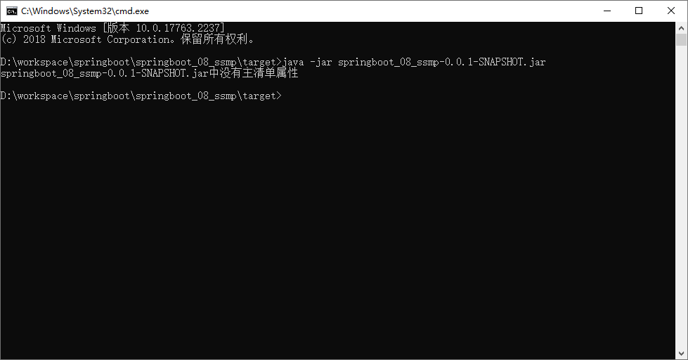

# 一、程序的打包与运行

刚开始学习开发的小伙伴可能有一个错误的认知，我们天天写程序是在 Idea 下写的，运行也是在 Idea 下运行的。


但是实际开发完成后，我们的项目是不可能运行在自己的电脑上的。


我们以后制作的程序是运行在专用的服务器上的，简单说就是将你做的程序放在一台独立运行的电脑上，这台电脑要比你开发使用的计算机更专业，并且安全等级各个方面要远超过你现在的电脑。


那我们的程序如何放置在这台专用的电脑上呢，这就要将我们的程序先组织成一个文件，然后将这个文件传输到这台服务器上。这里面就存在两个过程，一个是打包的过程，另一个是运行的过程。

<font color="#f0f"><b>温馨提示</b></font>

企业项目上线为了保障环境适配性会采用下面流程发布项目，这里不讨论此过程。

1. 开发部门使用 Git、SVN 等版本控制工具上传工程到版本服务器
2. 服务器使用版本控制工具下载工程
3. 服务器上使用 Maven 工具在当前真机环境下重新构建项目
4. 启动服务

继续说我们的打包和运行过程。所谓打包是指将程序转换成一个可执行的文件，所谓运行指不依赖开发环境执行打包产生的文件。上述两个操作都有对应的命令可以快速执行。

### 1.1、程序打包

SpringBoot 程序是基于 Maven 创建的，在 Maven 中提供有打包的指令，叫做 package。本操作可以在 Idea 环境下执行。可以直接双击生命周期下的 “package”，也可输入指令：

```shell
mvn package
```

打包后会产生一个与工程名类似的 jar 文件，其名称是由模块名 + 版本号 + .jar 组成的。

### 1.2、程序运行

程序包打好以后，就可以直接执行了。用终端打开程序包所在路径，执行指令：

```shell
java -jar 工程包名.jar
```

执行程序打包指令后，程序正常运行，与在 Idea 下执行程序没有区别。

<font color="#ff0000"><b>特别关注</b></font>：如果你的计算机中没有安装 Java 的 jdk 环境，是无法正确执行上述操作的，因为程序执行使用的是 Java 指令。

<font color="#ff0000"><b>特别关注</b></font>：jar 支持命令行启动需要依赖 maven 插件支持，请确认打包时是否具有 SpringBoot 对应的 maven 插件。在使用向导创建 SpringBoot 工程时，pom.xml 文件中会有如下配置，这一段配置千万不能删除，否则打包后无法正常执行程序。

```XML
<build>
    <plugins>
        <plugin>
            <groupId>org.springframework.boot</groupId>
            <artifactId>spring-boot-maven-plugin</artifactId>
        </plugin>
    </plugins>
</build>
```

**总结**

1. SpringBoot 工程可以基于 java 环境下独立运行jar文件启动服务
2. SpringBoot 工程执行 mvn 命令 package 进行打包
3. 执行 jar 命令：`java –jar 工程名.jar`

### 1.3、SpringBoot 程序打包失败处理

有些小伙伴打包以后执行会出现一些问题，导致程序无法正常执行，例如下面的现象



要想搞清楚这个问题就要说说 .jar 文件的工作机制了，知道了这个东西就知道如何避免此类问题的发生了。

搞 Java 开发平时会接触很多 jar 包，比如 mysql 的驱动 jar 包，而上面我们打包程序后得到的也是一个 jar 文件。这个时候如果你使用上面的 java -jar 指令去执行 mysql 的驱动 jar 包就会出现上述不可执行的现象，而我们的 SpringBoot 项目为什么能执行呢？其实是因为打包方式不一样。

在 SpringBoot 工程的 pom.xml 中有下面这组配置，这组配置决定了打包出来的程序包是否可以执行。

```XML
<build>
    <plugins>
        <plugin>
            <groupId>org.springframework.boot</groupId>
            <artifactId>spring-boot-maven-plugin</artifactId>
        </plugin>
    </plugins>
</build>
```

我们分别开启这段配置和注释掉这段配置分别执行两次打包，然后观察两次打包后的程序包的差别，共有 3 处比较明显的特征：

- 打包后文件的大小不同
- 打包后所包含的内容不同
- 打包程序中个别文件内容不同

先看第一个现象，文件大小不同。两次打包生成的程序包大小如下：


不难看出，带有配置的程序包体积比不带配置的大了 30 倍，那这里面都有什么呢？能差这么多？下面看看里面的内容有什么区别。


我们发现内容也完全不一样，仅有一个目录是一样的，叫做 META-INF。打开容量大的程序包中的 BOOT-INF 目录下的 classes 目录，我们发现其中的内容居然和容量小的程序包中的内容完全一样。


原来大的程序包中除了包含小的程序包中的内容，还有别的东西。都有什么呢？回到 BOOT-INF 目录下，打开 lib 目录，里面显示了很多个 jar 文件。


仔细翻阅不难发现，这些 jar 文件都是我们制作这个工程时导入的坐标对应的文件。大概可以想明白了，SpringBoot 程序为了让自己打包生成的程序可以独立运行，不仅将项目中自己开发的内容进行了打包，还把当前工程运行需要使用的 jar 包全部打包进来了。为什么这样做呢？就是为了可以独立运行。不依赖程序包外部的任何资源可以独立运行当前程序。这也是为什么大的程序包容量是小的程序包容量的 30 倍的主要原因。

再看看大程序包还有什么不同之处，在最外层目录包含一个 org 目录，进入此目录，目录名是 org\springframework\boot\loader，在里面可以找到一个 <font color="#ff0000"><b>JarLauncher.class</b></font> 的文件，先记得这个文件。再看这套目录名，明显是一个 Spring 的目录名，为什么要把 Spring 框架的东西打包到这个程序包中呢？不清楚。

回到两个程序包的最外层目录，查看名称相同的文件夹 META-INF 下都有一个叫做 MANIFEST.MF 的文件，但是大小不同，打开文件，比较内容区别

- 小容量文件的 MANIFEST.MF

  ```java
  Manifest-Version: 1.0
  Implementation-Title: springboot_08_ssmp
  Implementation-Version: 0.0.1-SNAPSHOT
  Build-Jdk-Spec: 1.8
  Created-By: Maven Jar Plugin 3.2.0
  ```

- 大容量文件的 MANIFEST.MF

  ```JAVA
  Manifest-Version: 1.0
  Spring-Boot-Classpath-Index: BOOT-INF/classpath.idx
  Implementation-Title: springboot_08_ssmp
  Implementation-Version: 0.0.1-SNAPSHOT
  Spring-Boot-Layers-Index: BOOT-INF/layers.idx
  Start-Class: com.itheima.SSMPApplication
  Spring-Boot-Classes: BOOT-INF/classes/
  Spring-Boot-Lib: BOOT-INF/lib/
  Build-Jdk-Spec: 1.8
  Spring-Boot-Version: 2.5.4
  Created-By: Maven Jar Plugin 3.2.0
  Main-Class: org.springframework.boot.loader.JarLauncher
  ```

大文件中明显比小文件中多了几行信息，其中最后一行信息是 Main-Class: org.springframework.boot.loader.<font color="#ff0000"><b>JarLauncher</b></font>。这句话什么意思呢？如果使用 java -jar 执行此程序包，将执行 Main-Class 属性配置的类，这个类恰巧就是前面看到的那个文件。原来 SpringBoot 打包程序中出现 Spring 框架的东西是为这里服务的。而这个 org.springframework.boot.loader.<font color="#ff0000"><b>JarLauncher</b></font> 类内部要查找 Start-Class 属性中配置的类，并执行对应的类。这个属性在当前配置中也存在，对应的就是我们的引导类类名。

现在这组设定的作用就搞清楚了：

1. SpringBoot 程序添加配置后会打出一个特殊的包，包含 Spring 框架部分功能，原始工程内容，原始工程依赖的 jar 包
2. 首先读取 MANIFEST.MF 文件中的 Main-Class 属性，用来标记执行 java -jar 命令后运行的类
3. JarLauncher 类执行时会找到 Start-Class 属性，也就是启动类类名
4. 运行启动类时会运行当前工程的内容
5. 运行当前工程时会使用依赖的 jar 包，从 lib 目录中查找

看来 SpringBoot 打出来了包为了能够独立运行，简直是煞费苦心，将所有需要使用的资源全部都添加到了这个包里。这就是为什么这个 jar 包能独立运行的原因。


再来看之前的报错信息：


由于打包时没有使用那段配置，结果打包后形成了一个普通的 jar 包，在 MANIFEST.MF 文件中也就没有了 Main-Class 对应的属性了，所以运行时提示找不到主清单属性，这就是报错的原因。

上述内容搞清楚对我们编程意义并不大，但是对各位小伙伴理清楚 SpringBoot 工程独立运行的机制是有帮助的。其实整体过程主要是带着大家分析，如果以后遇到了类似的问题，多给自己提问，多问一个为什么，慢慢自己就可以独立解决问题了。

> **总结**：spring-boot-maven-plugin 插件用于将当前程序打包成一个可以独立运行的程序包

### 1.4、命令行启动常见问题及解决方案

各位小伙伴在 DOS 环境下启动 SpringBoot 工程时，可能会遇到端口占用的问题。解决办法：

```shell
# 查询端口
netstat -ano

# 查询指定端口
netstat -ano | findstr "端口号"

# 根据进程PID查询进程名称
tasklist | findstr "进程PID号"

# 根据PID杀死任务
taskkill -F -pid "进程PID号"

# 根据进程名称杀死任务
taskkill -f -t -im "进程名称"
```

关于打包与运行程序其实还有一系列的配置和参数，下面的内容中遇到再说，这里先开个头，知道如何打包和运行程序。

### 1.5、Linux 系统下启动 SpringBoot 项目

其实对于 Linux 系统下的程序运行与 Windows 系统下的程序运行差别不大，命令还是那组命令，只不过要熟悉 Linux 系统的指令。

首先确保已安装好 JDK 和 MySQL，并已在数据库中创建好相应的表。

启动命令：`java -jar jar包名`

这是前台启动，最好换成后台启动：`nohup java -jar jar包名 > server.log 2>&1 &`，其中 server.log 是自定义的文件名

停止命令：

```shell
ps -f | grep "java -jar"
kill -9 PID号
```

# 二、配置高级

关于配置在基础篇讲过一部分，基础篇的配置总体上来说就是掌握配置的格式。比如配置文件如何写，写好的数据如何读取，都是基础的语法级知识。在实用篇中就要集中在配置的应用这个方面了，下面就开始配置高级相关内容的第一部分学习，为什么说第一部分，因为在开发实用篇中还有对应的配置高级知识要进行学习。

## 1、临时属性设置

目前我们的程序包打好了，可以发布了。但是程序包打好以后，里面的配置都已经是固定的了，比如配置了服务器的端口是 8080。如果我要启动项目，但发现当前我的服务器上已经有应用启动起来并且占用了 8080 端口，这个时候就尴尬了。难道要重新把打包好的程序修改一下吗？比如我要把打包好的程序启动端口改成 80。


SpringBoot 提供了灵活的配置方式，如果你发现你的项目中有个别属性需要重新配置，可以使用临时属性的方式快速修改某些配置。方法也特别简单，在启动的时候添加上对应参数就可以了。

```shell
java –jar springboot.jar –-server.port=80
```

上面的命令是启动 SpringBoot 程序包的命令，在命令输入完毕后，空一格，然后输入两个 - 号。后面按照 `属性名=属性值` 的形式添加对应参数就可以了。注意这里的格式不是 yaml 中的书写格式，当属性存在多级名称时，中间使用点号分隔，和 properties 文件中的属性格式完全相同。

如果要修改的属性不止一个，可以按照上述格式继续写，属性与属性之间使用空格分隔。

```shell
java –jar springboot.jar –-server.port=80 --logging.level.root=debug
```

### 1.1、属性加载优先级

现在我们的程序配置受两个地方控制了，第一配置文件，第二临时属性。并且我们发现临时属性的加载优先级要高于配置文件的。那是否还有其他的配置方式呢？其实是有的，而且还不少，打开官方文档中对应的内容，就可以查看配置读取的优先顺序。

官方文档地址：[https://docs.spring.io/spring-boot/docs/current/reference/html/spring-boot-features.html#boot-features-external-config](https://docs.spring.io/spring-boot/docs/current/reference/html/spring-boot-features.html)


我们可以看到，居然有 14 种配置的位置，而我们现在使用的是这里面的 2 个。第 3 条 Config data 说的就是使用配置文件，第 11 条 Command line arguments 说的就是使用命令行临时参数。而这 14 种配置的顺序就是 SpringBoot 加载配置的顺序。言外之意，命令行临时属性比配置文件的加载优先级高，所以这个列表上面的优先级低，下面的优先级高。其实这个东西不用背的，你就记得一点，你最终要什么效果，你自己是知道的，不管这个顺序是怎么个高低排序，开发时一定要配置成你要的顺序为准。这个顺序只是在你想不明白问题的时候帮助你分析罢了。

比如你现在加载了一个 user.name 属性。结果你发现出来的结果和你想的不一样，那肯定是别的优先级比你高的属性覆盖你的配置属性了，那你就可以看着这个顺序挨个排查，哪个位置有可能覆盖了你的属性。其实是因为在系统属性中有一个属性叫做 user.name，两个相互冲突了。而系统属性的加载优先顺序在上面这个列表中是 5 号，高于 3 号，所以 SpringBoot 最终会加载系统配置属性 user.name。

**总结**

1. 使用 jar 命令启动 SpringBoot 工程时可以使用临时属性替换配置文件中的属性
2. 临时属性添加方式：`java –jar 工程名.jar –-属性名=值`
3. 多个临时属性之间使用空格分隔
4. 临时属性必须是当前 boot 工程支持的属性，否则设置无效

### 1.2、开发环境中使用临时属性

临时使用目前是有了，但是上线的时候通过命令行输入的临时属性必须是正确的啊，那这些属性配置值我们必须在开发环境中测试好才行。下面说一下开发环境中如何使用临时属性，其实就是 Idea 界面下如何操作。

打开 SpringBoot 引导类的运行界面，在里面找到配置项。其中 Program arguments 对应的位置就是添加临时属性的，可以加几个试试效果。


做到这里其实可以产生一个思考了，如果对 Java 编程熟悉的人应该知道，我们运行 main 方法的时候，如果想使用 main 方法的参数，也就是下面的 args 参数，就是在上面这个位置添加的参数。

```java
public static void main(String[] args) {
}
```

原来是这样，通过这个 args 就可以获取到参数。再来看我们的引导类是如何书写的

```java
public static void main(String[] args) {
    SpringApplication.run(SSMPApplication.class,args);
}
```

这个 args 参数居然传递给了 run 方法，看来在 Idea 中配置的临时参数就是通过这个位置传递到我们的程序中的。言外之意，这里如果不用这个 args 是不是就断开了外部传递临时属性的入口呢？是这样的，我们可以使用下面的调用方式，这样外部临时属性就无法进入到 SpringBoot 程序中了。

```java
public static void main(String[] args) {
    SpringApplication.run(SSMPApplication.class);
}
```

或者还可以使用如下格式来玩这个操作，就是将配置不写在配置文件中，直接写成一个字符串数组，传递给程序入口。当然，这种做法并没有什么实际开发意义。

```JAVA
public static void main(String[] args) {
    String[] arg = new String[1];
    arg[0] = "--server.port=8082";
    SpringApplication.run(SSMPApplication.class, arg);
}
```

> 总结：启动 SpringBoot 程序时，可以选择是否使用命令行属性为 SpringBoot 程序传递启动属性

**思考**

现在使用临时属性可以在启动项目前临时更改配置了，但是新的问题又出来了。临时属性好用是好用，就是写的多了会很麻烦。比如我现在有个需求，上线的时候使用临时属性配置 20 个值，这下可麻烦了，能不能搞得简单点，集中管理一下呢？比如说搞个文件，加载指定文件？还真可以。怎么做呢？下一节再说。

## 2、配置文件分类

SpringBoot 提供了配置文件和临时属性的方式来对程序进行配置。前面一直说的是临时属性，这一节要说说配置文件了。其实这个配置文件我们一直在使用，只不过我们用的是 SpringBoot 提供的 4 级配置文件中的其中一个级别。4 个级别分别是：

- 类路径下配置文件（一直使用的是这个，也就是 resources 目录下的 application.yml 文件）
- 类路径下 config 目录下配置文件
- 程序包所在目录中配置文件
- 程序包所在目录中 config 目录下配置文件

上述 4 种文件提供了 4 种配置文件书写的位置，功能都是一样的，都是做配置的。但因为位置不同，产生了差异。总体上来说，4 种配置文件如果都存在的话，有一个优先级的问题，说白了就是假如 4 个文件我都有，里面都有一样的配置，谁生效的问题。上面 4 个文件的加载优先顺序为

1. `file：config/application.yml` **【最高】**
2. `file：application.yml`
3. `classpath：config/application.yml`
4. `classpath：application.yml`  **【最低】**

作用：

* 1 级与 2 级留做系统打包后设置通用属性，1 级常用于运维经理进行线上整体项目部署方案调控
* 3 级与 4 级用于系统开发阶段设置通用属性，3 级常用于项目经理进行整体项目属性调控

那为什么设计这种多种呢？说一个最典型的应用吧。

- 场景 A：你作为一个开发者，你做程序的时候为了方便自己写代码，配置的数据库肯定是连接你自己本机的，咱们使用 4 这个级别，也就是之前一直用的 application.yml。
- 场景 B：现在项目开发到了一个阶段，要联调测试了，连接的数据库是测试服务器的数据库，肯定要换一组配置吧。你可以选择把你之前的文件中的内容都改了，目前还不麻烦。
- 场景 C：测试完了，一切 OK。你继续写你的代码，你发现你原来写的配置文件被改成测试服务器的内容了，你要再改回来。现在明白了不？场景 B 中把你的内容都改掉了，你现在要重新改回来，以后呢？改来改去吗？

解决方案很简单，用上面的 3 这个级别的配置文件就可以快速解决这个问题，再写一个配置就行了。两个配置文件共存，因为 config 目录中的配置加载优先级比你的高，所以配置项如果和级别 4 里面的内容相同就覆盖了，这样是不是很简单？

级别 1 和 2 什么时候使用呢？程序打包以后就要用这个级别了，管你程序里面配置写的是什么？我的级别高，可以轻松覆盖你，就不用考虑这些配置冲突的问题了。

**总结**

1. 配置文件分为 4 种

   - 项目类路径配置文件：服务于开发人员本机开发与测试
   - 项目类路径 config 目录中配置文件：服务于项目经理整体调控
   - 工程路径配置文件：服务于运维人员配置涉密线上环境
   - 工程路径 config 目录中配置文件：服务于运维经理整体调控

2. 多层级配置文件间的属性采用叠加并覆盖的形式作用于程序

## 3、自定义配置文件

之前使用的配置文件都是 application.yml，其实这个文件也是可以改名字的，这样方便维护。比如某次搞活动写了一组配置，后面活动结束要恢复原始配置，这个时候只需要重新更换一下配置文件就可以了。但是你总不能在原始配置文件上修改吧，不然搞完活动以后，活动的配置就留不下来了，不利于维护。

自定义配置文件方式有如下两种：

**方式一：使用临时属性设置配置文件名，注意仅仅是名称，不要带扩展名**


**方式二：使用临时属性设置配置文件路径，这个是全路径名**


也可以设置加载多个配置文件


使用的属性一个是 `spring.config.name`，另一个是 `spring.config.location`，这个一定要区别清楚。

<font color="#f0f"><b>温馨提示</b></font>

我们现在研究的都是 SpringBoot 单体项目，就是单服务器版本。其实企业开发现在更多的是使用基于 SpringCloud 技术的多服务器项目。这种配置方式和我们现在学习的完全不一样，所有的服务器将不再设置自己的配置文件，而是通过配置中心获取配置，动态加载配置信息。为什么这样做？集中管理。学习微服务后会明白

**总结**

1. 配置文件可以修改名称，通过启动参数设定
2. 配置文件可以修改路径，通过启动参数设定
3. 微服务开发中配置文件通过配置中心进行设置

# 三、多环境开发

什么是多环境？其实就是说你的电脑上写的程序最终要放到别人的服务器上去运行。每个计算机环境不一样，这就是多环境。常见的多环境开发主要兼顾 3 种环境设置，开发环境——自己用的，测试环境——自己公司用的，生产环境——甲方爸爸用的。因为这是绝对不同的三台电脑，所以环境肯定有所不同，比如连接的数据库不一样，设置的访问端口不一样等等。


## 1、yaml 单一文件版

什么是多环境开发？就是针对不同的环境设置不同的配置属性即可。比如自己开发时，配置端口如下：

```yaml
server:
  port: 80
```

如果想设计两组环境呢？中间使用三个减号分隔开

```yaml
server:
  port: 80
---
server:
  port: 81
```

如何区分两种环境呢？起名字呗

```yaml
spring:
	profiles: pro
server:
	port: 80
---
spring:
	profiles: dev
server:
	port: 81
```

那用哪一个呢？设置默认启动哪个就可以了

```yaml
spring:
	profiles:
		active: pro		# 启动pro
---
spring:
	profiles: pro
server:
	port: 80
---
spring:
	profiles: dev
server:
	port: 81
```

就这么简单，再多来一组环境也 OK

```yaml
# 应用环境
# 一般在应用环境写公共配置
spring:
	profiles:
		active: pro		# 启动pro
---
# 设置环境
# 生产环境
spring:
	profiles: pro
server:
	port: 80
---
# 开发环境
spring:
	profiles: dev
server:
	port: 81
---
# 测试环境
spring:
	profiles: test
server:
	port: 82
```

其中关于环境名称定义的格式是过时格式，标准格式如下

```yaml
spring:
	config:
    	activate:
        	on-profile: pro
```


**总结**

1. 多环境开发需要设置若干种常用环境，例如开发、生产、测试环境
2. yaml 格式中设置多环境使用——区分环境设置边界
3. 每种环境的区别在于加载的配置属性不同
4. 启用某种环境时需要指定启动时使用该环境

## 2、yaml 多文件版

将所有的配置都放在一个配置文件中，尤其是每一个配置应用场景都不一样，可能会暴露出一些机密配置，这显然不合理，于是就有了将一个配置文件拆分成多个配置文件的想法。拆分后，每个配置文件中写自己的配置，主配置文件中写清楚用哪一个配置文件就好了。

**主配置文件**

```yaml
spring:
	profiles:
		active: pro		# 启动pro
```

**环境配置文件**

```yaml
server:
	port: 80
```

环境配置文件因为每一个都是配置自己的项，所以连名字都不用写里面了。那问题是如何区分这是哪一组配置呢？使用文件名区分。

**application-pro.yaml**

```yaml
server:
	port: 80
```

**application-dev.yaml**

```yaml
server:
	port: 81
```

文件的命名规则为：`application-环境名.yml`。

在配置文件中，如果某些配置项所有环境都一样，可以将这些项写入到主配置中，只有那些有区别的项才写入到环境配置文件中。

- 主配置文件中设置公共配置（全局）
- 环境分类配置文件中常用于设置冲突属性（局部）

**总结**

1. 可以使用独立配置文件定义环境属性

2. 独立配置文件便于线上系统维护更新并保障系统安全性


## 3、properties 多文件版

SpringBoot 最早期提供的配置文件格式是 properties 格式的，这种格式的多环境配置也可以了解一下。

**主配置文件**

**application.properties**

```properties
spring.profiles.active=pro
```

**环境配置文件**

**application-pro.properties**

```properties
server.port=9080
```

**application-dev.properties**

```properties
server.port=9081
```

文件的命名规则为：`application-环境名.properties`。

> 注意：properties 文件多环境配置仅支持多文件格式

## 4、多环境开发独立配置文件书写技巧

作为程序员在搞配置的时候往往处于一种分久必合合久必分的局面。开始先写一起，后来为了方便维护就拆分。对于多环境开发也是如此，下面给大家说一下如何基于多环境开发做配置独立管理，务必掌握。

**准备工作**

将所有的配置根据功能对配置文件中的信息进行拆分，并制作成独立的配置文件，命名规则如下

- application-devDB.yml
- application-devRedis.yml
- application-devMVC.yml

**使用**

使用 include 属性在激活指定环境的情况下，同时对多个环境进行加载使其生效，多个环境间使用逗号分隔

```yaml
spring:
	profiles:
    	active: dev
        include: devDB,devRedis,devMVC
```

比较一下，现在相当于加载 dev 配置时，再加载对应的 3 组配置，从结构上就很清晰，用了什么以及对应的名称是什么

> **注意**：当主环境 dev 与其他环境有相同属性时，主环境属性生效；其他环境中有相同属性时，最后加载的环境属性生效

**改良**

但是上面的设置也有一个问题，比如我要切换 dev 环境为 pro 时，include 也要修改。因为 include 属性只能使用一次，这就比较麻烦了。SpringBoot 从 2.4 版本开始使用 `group` 属性替代 include 属性，使用 group 属性定义多种主环境与子环境的包含关系，降低了配置书写量。简单说就是我先写好，你爱用哪个用哪个。

```yaml
spring:
	profiles:
    	active: dev
        group:
        	"dev": devDB,devRedis,devMVC
      		"pro": proDB,proRedis,proMVC
      		"test": testDB,testRedis,testMVC
```

现在再来看，如果切换 dev 到 pro，只需要改一下是不是就结束了？完美！

**总结**

1. 多环境开发使用 group 属性设置配置文件分组，便于线上维护管理

## 5、多环境开发控制

多环境开发到这里基本上说完了，最后说一个冲突问题。就是 maven 和 SpringBoot 同时设置多环境的话怎么搞。

要想处理这个冲突问题，需要先理清一个关系，究竟谁在多环境开发中其主导地位。也就是说如果现在都设置了多环境，谁的应该是保留下来的，另一个应该遵从相同的设置。

maven 是做什么的？项目构建管理的，最终生成代码包的；SpringBoot 是干什么的？简化开发的。简化，又不是起主导作用。最终还是要靠 maven 来管理整个工程，所以 SpringBoot 应该听 maven 的。整个确认后下面就好做了。大体思想如下：

- 先在 maven 环境中设置用什么具体的环境
- 在 SpringBoot 中读取 maven 设置的环境即可

1、**maven 中设置多环境（使用属性方式区分环境）**

```xml
<profiles>
    <profile>
        <id>env_dev</id>
        <properties>
            <profile.active>dev</profile.active>
        </properties>
        <activation>
            <!--默认启动环境-->
            <activeByDefault>true</activeByDefault>
        </activation>
    </profile>
    <profile>
        <id>env_pro</id>
        <properties>
            <profile.active>pro</profile.active>
        </properties>
    </profile>
</profiles>
```

2、**SpringBoot 中读取 maven 设置值**

```yaml
spring:
	profiles:
    	active: @profile.active@
```

上面的 `@属性名@` 就是读取 maven 中配置的属性值的语法格式。


3、执行 Maven 打包指令，并在生成的 boot 打包文件 .jar 文件中查看对应信息

**总结**

1. 当 Maven 与 SpringBoot 同时对多环境进行控制时，以 Mavn 为主，SpringBoot 使用 @..@ 占位符读取 Maven 对应的配置属性值
2. 基于 SpringBoot 读取 Maven 配置属性的前提下，如果在 Idea 下测试工程时 pom.xml 每次更新需要手动 compile 或者刷新 maven 方可生效

# 四、日志

日志其实就是记录程序日常运行的信息，主要作用如下：

- 编程期调试代码
- 运营期记录信息
  - 记录日常运营重要信息（峰值流量、平均响应时长……）
  - 记录应用报错信息（错误堆栈）
  - 记录运维过程数据（扩容、宕机、报警……）


## 1、代码中使用日志工具记录日志

日志的使用格式非常固定，直接上操作步骤：

**步骤①**：添加日志记录操作

```JAVA
import org.slf4j.Logger;
import org.slf4j.LoggerFactory;

@RestController
@RequestMapping("/books")
public class BookController extends BaseClass{
    //创建记录日志的对象
    private static final Logger log = LoggerFactory.getLogger(BookController.class);
    
    @GetMapping
    public String getById(){
        log.debug("debug...");
        log.info("info...");
        log.warn("warn...");
        log.error("error...");
        
        return "springboot is running...2";
    }
}
```

上述代码中 log 对象就是用来记录日志的对象，下面的 log.debug，log.info 这些操作就是写日志的 API 了。

**步骤②**：设置日志输出级别

日志设置好以后可以根据设置选择哪些参与记录。这里是根据日志的级别来设置的。日志的级别分为 6 种，分别是：

- TRACE：运行堆栈信息，使用率低
- DEBUG：程序员调试代码使用
- INFO：记录运维过程数据
- WARN：记录运维过程报警数据
- ERROR：记录错误堆栈信息
- FATAL：灾难信息，合并计入 ERROR

一般情况下，开发时候使用 DEBUG，上线后使用 INFO，运维信息记录使用 WARN 即可。

下面就设置一下日志级别：

```yaml
# 开启debug模式，输出调试信息，常用于检查系统运行状况
debug: true
```

这么设置太简单粗暴了，不推荐使用，日志系统通常都提供了细粒度的控制

```yaml
# 开启debug模式，输出调试信息，常用于检查系统运行状况
debug: true

# 设置日志级别，root表示根节点，即整体应用日志级别
logging:
	level:
    	root: debug
```

还可以再设置更细粒度的控制

**步骤③**：设置日志组，控制指定包对应的日志输出级别，也可以直接控制指定包对应的日志输出级别

```yaml
logging:
	# 设置日志组
    group:
    	# 自定义组名，设置当前组中所包含的包
        ebank: com.itheima.controller
    level:
    	root: warn
        # 设置某个组的日志级别
        ebank: debug
    	# 设置某个包的日志级别
        com.itheima.controller: debug
```

说白了就是总体设置一下，每个包设置一下，如果感觉设置的麻烦，就先把包分个组，对组设置，没了就这些。

**总结**

1. 日志用于记录开发调试与运维过程消息
2. 日志的级别共 6 种，通常使用 4 种即可，分别是 DEBUG、INFO、WARN、ERROR
3. 可以通过日志组或代码包的形式进行日志显示级别的控制

## 2、优化日志对象创建代码

写代码的时候每个类都要写创建日志记录对象，这个可以优化一下，使用前面用过的 lombok 技术给我们提供的工具类即可。

```java
@RestController
@RequestMapping("/books")
public class BookController extends BaseClass{
    private static final Logger log = LoggerFactory.getLogger(BookController.class);	//这一句可以不写了
}
```

导入 lombok 后使用 @Slf4j 注解搞定，日志对象名为 log

```java
@Slf4j		//这个注解替代了下面那一行
@RestController
@RequestMapping("/books")
public class BookController extends BaseClass{
    //这一句可以不写了
    //private static final Logger log = LoggerFactory.getLogger(BookController.class);
}
```

> **总结**：基于 lombok 提供的 @Slf4j 注解为类快速添加日志对象

## 3、日志输出格式控制

日志已经能够记录了，但是目前记录的格式是 SpringBoot 给我们提供的，如果想自定义控制就需要自己设置了。

先分析一下当前日志的记录格式。


* PID：进程 ID，用于表明当前操作所处的进程，当多服务同时记录日志时，该值可用于协助程序员调试程序
* 所属类 / 接口名：当前显示信息为 SpringBoot 重写后的信息，名称过长时，简化包名书写为首字母，甚至直接删除

对于单条日志信息来说，日期、触发位置、记录信息是最核心的信息。级别用于做筛选过滤，PID 与线程名用于做精准分析。了解这些信息后就可以 DIY 日志格式了。在此不做详细的研究，只给出模拟官方日志模板的书写格式。

```yaml
# 设置日志输出格式
logging:
  pattern:
    # console: "%d - %m%n"
    console: "%d %clr(%p) --- [%16t] %clr(%-40.40c){cyan} : %m %n"
```

* %d：日期
* %m：消息
* %n：换行

> **总结**：日志输出格式设置规则

## 4、日志文件

日志信息显示、记录已经控制住了，下面就要说一下日志的转存了。日志不能仅显示在控制台上，要把日志记录到文件中，方便后期维护查阅。

对于日志文件的使用存在各种各样的策略，例如每日记录，分类记录，报警后记录等。这里主要研究日志文件如何记录。

记录日志到文件中格式非常简单，设置日志文件名即可。

```YAML
logging:
	file:
    	name: server.log
```

虽然使用上述格式可以将日志记录下来了，但是面对线上的复杂情况，一个文件记录肯定是不能够满足运维要求的，通常会每天记录日志文件，同时为了便于维护，还要限制每个日志文件的大小。下面给出日志文件的常用配置方式：

```YAML
logging:
	logback:
    	rollingpolicy:
        	max-file-size: 3KB
            file-name-pattern: server.%d{yyyy-MM-dd}.%i.log
```

以上格式是基于 logback 日志技术设置每日日志文件的设置格式，要求容量到达 3KB 以后就转存信息到第二个文件中。文件命名规则中的 %d 标识日期，%i 是一个递增变量，用于区分日志文件。

**总结**

1. 日志记录到文件
2. 日志文件格式设置
